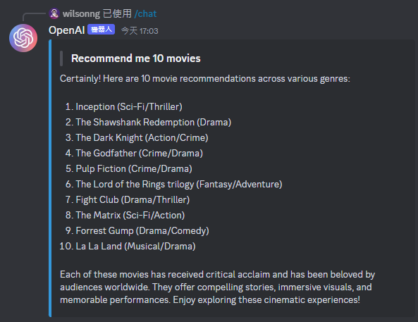

# OpenAI Discord Bot

This project is a Discord bot using OpenAI models to generate messages and images based on user inputs.

There are two functionalities supported by the bot:

-   `/chat` - Responds to a message with a message generated by the GPT-3.5 model
-   `/image` - Responds to a message with an image generated by the DALL-E model

## Architecture


## Installation

AWS-CLI: version 2.12.6  
NodeJS: version 16.15.1  
NPM: version 9.6.7

## Getting Started

### Installing Dependencies

Run `npm ci` to install the dependencies

### DynamoDB Configuration

Run `node .\dynamoDB\createTable.js` to create the DynamoDB table

### Discord Bot Configuration

1. Create a new Discord application at https://discord.com/developers/applications
2. Copy `APPLICATION ID` and `PUBLIC KEY` from the application's `General Information` page
3. Copy `TOKEN` from the application's `Bot` page

### Dotenv Configuration

Create a `.env` file in the root directory of the project:

```
APP_ID={`APPLICATION ID` copied from Discord application's `General Information` page`}
PUBLIC_KEY={`PUBLIC KEY` copied from Discord application's `General Information` page}
BOT_TOKEN={`TOKEN` copied from Discord application's `Bot` page`}

OPENAI_API_KEY={OpenAI API key}
```

### AWS Lambda Configuration

1. Create an execution role  
   `aws iam create-role --role-name openai-discord-bot-lambda-role --assume-role-policy-document file://trust-policy.json`
2. Add AWSLambdaBasicExecutionRole managed policy to the role  
   `aws iam attach-role-policy --role-name openai-discord-bot-lambda-role --policy-arn arn:aws:iam::aws:policy/service-role/AWSLambdaBasicExecutionRole`
3. Add AmazonDynamoDBFullAccess managed policy to the role  
   `aws iam attach-role-policy --role-name openai-discord-bot-lambda-role --policy-arn arn:aws:iam::aws:policy/AmazonDynamoDBFullAccess`
4. Zip the function code  
   `zip -r OpenAI-Discord-Bot.zip .`
5. Create a Lambda function

```
aws lambda create-function `
--function-name openai-discord-bot-lambda-function `
--zip-file fileb://OpenAI-Discord-Bot.zip `
--handler index.handler `
--runtime nodejs18.x `
--role arn:aws:iam::$(aws sts get-caller-identity --query "Account" --output text):role/openai-discord-bot-lambda-role
```

1. Configure timeout as 900 seconds  
   `aws lambda update-function-configuration --function-name openai-discord-bot-lambda-function --timeout 900`

2. Go to AWS Lambda console to `Add Trigger` for the function.  
   Choose `API Gateway` and `Create a new API`.  
   Choose `HTTP API` and `Open` for security.  
   Set up `API name` and select `CORS` in additional settings
3. Copy the `API endpoint` of the created `API Gateway`

### Discord Bot Interaction Setup

1. Go to Discord application as created above
2. Paste `API endpoint` of `API Gateway` into the `INTERACTIONS ENDPOINT URL` field of the application's `General Information` page
3. Go to OAuth2 section → URL Generator.  
   Scopes: `bot`, `application.commands`.  
   Bot permissions: `Use Slash Commands`.  
   Use the generated URL to invite the bot to your channel

### Slash Commands Registration

Option1 is **not recommended** as it registers commands for all channels and is slower.  
Option2 is **recommended** as it is faster to registers commands for a specific channel.

Option 1:

1. Register slash commands by running `node .\discord\registerAll.js`

Option 2:

1. Add `GUILD_ID={your Discord channel's guild id}` to `.env` file
2. Run `node .\discord\register.js`

## Use cases

### Chat

1. User input message  
   
2. Bot respond message  
   

### Image

1. User input prompt and size(optional)  
   
2. Bot respond image  
   
